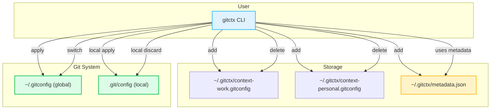

# Introduction

## What is gitctx?

`gitctx` is a lightweight command-line tool written in Go that helps developers **manage and switch between multiple Git contexts** (identities) effortlessly.  
Whether you contribute to open-source projects, work across multiple companies, or just want to separate personal and professional commits, `gitctx` makes identity management painless.

It centralizes your `.gitconfig` profiles in one place and gives you commands to:

- Store unlimited named Git contexts
- Apply a context **globally** or **locally** to a single repo
- Quickly toggle between your current and previous identity
- Manage SSH and GPG keys per context

## Mermaid Diagram



---

## Why use gitctx?

Switching Git identities manually is error-prone and time-consuming. You’ve probably:

- Committed with the wrong email to the wrong repo
- Spent time editing `.gitconfig` by hand
- Forgotten to switch back to your personal profile before pushing

With `gitctx`, you can:

- Change identities in seconds
- Keep your Git configs **organized** and **easy to back up**
- Avoid costly mistakes by clearly tracking your current identity
- Integrate with tools like **LazyGit** for even smoother workflows

---

## How it works

`gitctx` stores your contexts in `~/.gitctx/` as plain `.gitconfig` files and tracks metadata like:

- The **current** context in use
- The **previous** context (for quick switching)

When you apply a context:

- **Global mode** updates your main `~/.gitconfig`
- **Local mode** applies only to the nearest repository (`.git/config`)

Because contexts are just `.gitconfig` files, you can edit them manually or import/export them easily.

---

## Example usage

```bash
# Create a new context interactively
gitctx add work

# Apply it globally
gitctx apply work

# Switch back to your previous context
gitctx switch

# Apply a context only for the current repository
gitctx local apply personal
```
