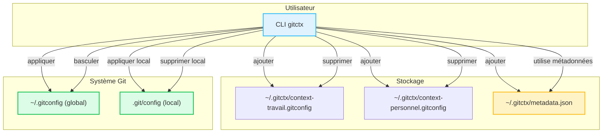

# Introduction

## Qu'est-ce que gitctx ?

`gitctx` est un outil en ligne de commande léger écrit en Go qui aide les développeurs à **gérer et basculer entre plusieurs contextes Git** (identités) sans effort.  
Que vous contribuiez à des projets open-source, travailliez dans plusieurs entreprises, ou souhaitiez simplement séparer vos commits personnels et professionnels, `gitctx` rend la gestion des identités simple.
Il centralise vos profils `.gitconfig` en un seul endroit et vous donne des commandes pour :

- Stocker un nombre illimité de contextes Git nommés
- Appliquer un contexte **globalement** ou **localement** à un seul dépôt
- Basculer rapidement entre votre identité actuelle et précédente
- Gérer les clés SSH et GPG par contexte

## Diagramme Mermaid



---

## Pourquoi utiliser gitctx ?

Basculer manuellement entre les identités Git est sujet aux erreurs et chronophage. Vous avez probablement :

- Commité avec la mauvaise adresse e-mail sur le mauvais dépôt
- Perdu du temps à éditer `.gitconfig` à la main
- Oublié de revenir à votre profil personnel avant de pousser
  Avec `gitctx`, vous pouvez :
- Changer d'identité en quelques secondes
- Garder vos configurations Git **organisées** et **faciles à sauvegarder**
- Éviter des erreurs coûteuses en suivant clairement votre identité actuelle
- Intégrer avec des outils comme **LazyGit** pour des workflows encore plus fluides

---

## Comment ça fonctionne

`gitctx` stocke vos contextes dans `~/.gitctx/` sous forme de fichiers `.gitconfig` simples et suit les métadonnées comme :

- Le contexte **actuel** en cours d'utilisation
- Le contexte **précédent** (pour un basculement rapide)
  Quand vous appliquez un contexte :
- Le **mode global** met à jour votre `~/.gitconfig` principal
- Le **mode local** s'applique seulement au dépôt le plus proche (`.git/config`)
  Parce que les contextes sont juste des fichiers `.gitconfig`, vous pouvez les éditer manuellement ou les importer/exporter facilement.

---

## Exemple d'utilisation

```bash
# Créer un nouveau contexte de manière interactive
gitctx add travail
# L'appliquer globalement
gitctx apply travail
# Revenir à votre contexte précédent
gitctx switch
# Appliquer un contexte seulement pour le dépôt actuel
gitctx local apply personnel
```
